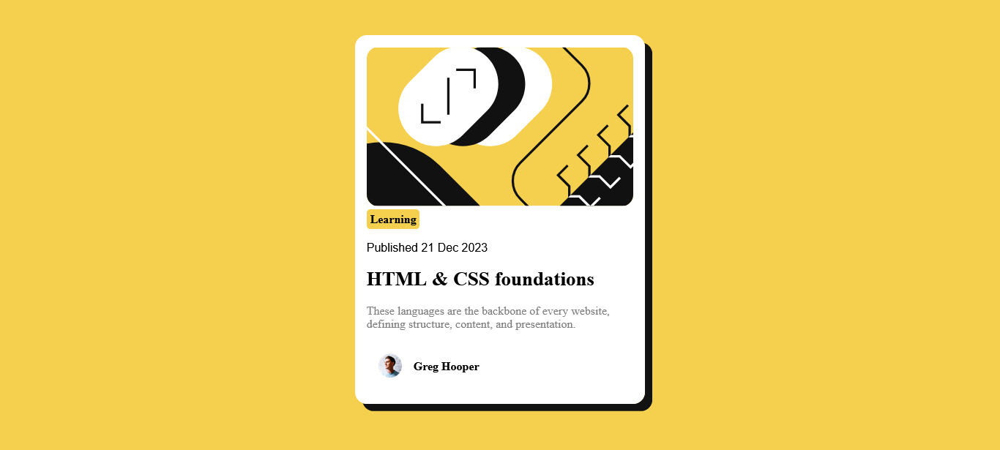

# Frontend Mentor - Blog preview card solution

This is a solution to the [Blog preview card challenge on Frontend Mentor](https://www.frontendmentor.io/challenges/blog-preview-card-ckPaj01IcS). Frontend Mentor challenges help you improve your coding skills by building realistic projects. 

## Table of contents

- [Overview](#overview)
  - [The challenge](#the-challenge)
  - [Screenshot](#screenshot)
  - [Links](#links)
- [My process](#my-process)
  - [Built with](#built-with)
  - [What I learned](#what-i-learned)
  
- [Author](#author)

## Overview
This blog preview card is an example of how the preview card can be designed to entice users to click through to read the full blog post.

### The challenge

Users should be able to:

- See hover and focus states for all interactive elements on the page

### Screenshot

### Links

- Solution URL: [Add solution URL here](https://your-solution-url.com)
- Live Site URL: [Add live site URL here](https://your-live-site-url.com)

## My process
- Firstly, Opened the downloaded files with VS code
- Edited the index.html file with entering the semantic tags like div, main, p, h1, img 
- Created the css file for the styles
- Linked the css file into the html
- Adjusted the style sheet for the preview card to resemble the one provieded in the design

### Built with

- Semantic HTML5 markup
- CSS custom properties
- Flexbox

### What I learned
In my css design, learnt new attributes like box-shadow`

## Author

- Website - [Joshua Muwanguzi](https://github.com/jmuwan)
- Frontend Mentor - [@jmuwan](https://www.frontendmentor.io/profile/jmuwan)
- Twitter - [@mwanguzijosh25](https://www.twitter.com/muwanguzijosh25)
